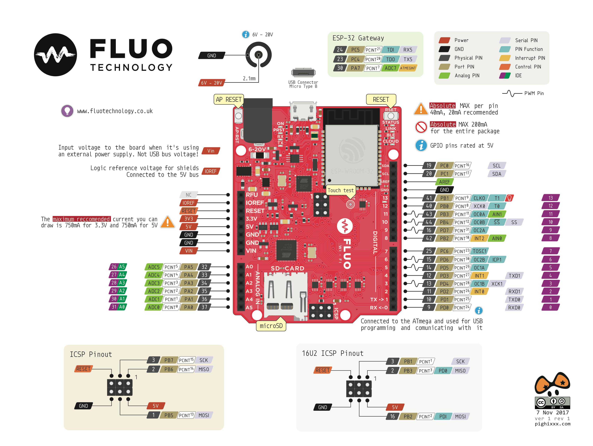

# FLUO_IOT  (Arduino core for FLUO boards)

The FLUO boards are the best development board for creating your own connected objects and IoT solutions. 
In particular, the FLUO WI-FI is based on the ATmega644p by ATMEL (MICROCHIP), compatible with the Arduino Ecosystem;
as well as on the ESP32 module by ESPRESSIF, providing it with Wi-Fi and Bluetooth Low Energy (BLE) connectivity.

## Contents
- [Development Status](#development-status)
- [Installation Instructions](#installation-instructions)
- [FLUO WI-FI Board PINMAP](#fluo-board-pinmap)
- [Fluo Guide](#fluo-guide)

## Development Status
Most of the framework is implemented.
- ESP32 examples are all implemented.
- AVR side is completly support by Arduino.
- FluoTube allow the communication between the AVR and ESP.

## Installation Instructions

- Using Arduino IDE
  + [Instructions for Windows](docs/arduino-ide/windows.md)
  + [Instructions for Mac](docs/arduino-ide/mac.md)
  + [Instructions for Debian/Ubuntu Linux](docs/arduino-ide/debian_ubuntu.md)
  + [Instructions for Fedora](docs/arduino-ide/fedora.md)
  + [Instructions for openSUSE](docs/arduino-ide/opensuse.md)

## FLUO WI-FI Board PINMAP

## Fluo Guide

### SIDE ESP32

You only have all the examples of the ArduinoIDE for ESP32 available.
You can not use other examples, such as blink and the like.
If you use the examples of the FluoTube library you can use the best of your FLUO WI-FI.

### SIDE AVR

You can use all the examples available.
If you are using sketches on ESP32 and you want AVR to speak correctly with it, 
you need to program the AVR part with the following example sketch: FluoTube -> IoTWebPanel

## News
In the next days the new ArduinoIDE FluoEdition will be available for download with the latest news.
The following guide and our Wiki will be updated on the site, providing all the details of the functioning of the SW that runs on your FLUO WI-FI.

website:  fluotechnology.co.uk/